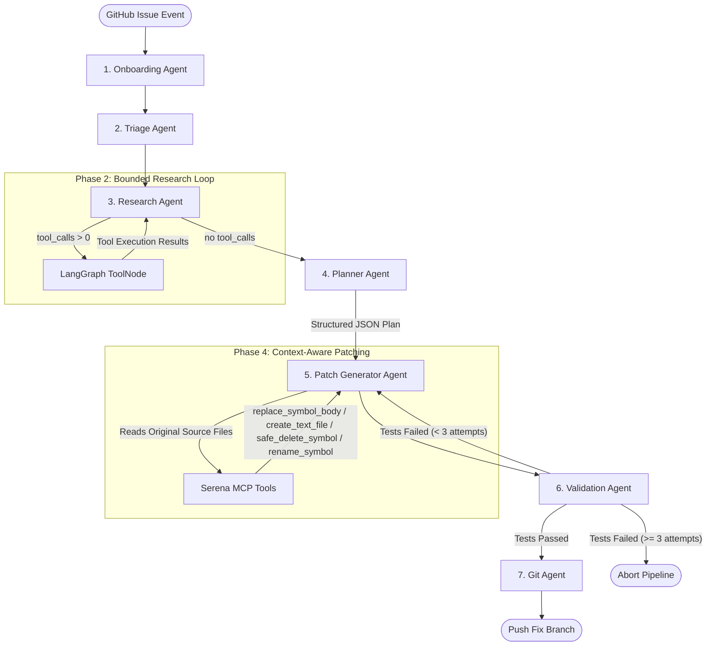

# Architecture Plan: Serena MCP Integration

> **Last Updated:** 2026-08-08

## 1. Goal Description
The objective is to integrate the Serena Model Context Protocol (MCP) server into the LazyDev architecture. Serena acts as a sidecar "IDE for the agent," providing language-server-backed (LSP) precise symbol navigation, impact analysis, and **full CRUD symbol-level code modifications** (create, read, modify, delete, rename). This integration works *in tandem* with the existing RAG (Qdrant) pipeline, solving token-inefficiency issues and eliminating fragile, regex/line-number-based patching.

## 2. Core Architectural Decisions
- **Deployment Strategy: Separate Container (Sidecar)**
  - Serena runs in a **separate** container rather than inside the existing NestJS app container.
  - **Why separate (Sidecar)?**
    - *Pros:* Serena relies on Python, `uv`, and requires dozens of Language Server binaries (Java, Rust, Go, Python, etc.) to support 40+ languages. Putting this in a separate container prevents the NestJS API image from ballooning to 5GB+ in size. If Serena crashes, the API stays up.
    - *Cons:* Requires network communication (Streamable HTTP) between the containers and shared volume mounts.
  - **Why not the same container (Embedded)?**
    - *Pros:* Easier communication (standard I/O pipes instead of networking).
    - *Cons:* Bloats the primary app image massively. Mixes Node.js runtime environments with Python/`uv` and language-specific SDKs, increasing the risk of dependency conflicts and slowing down CI/CD build times.
- **Transport Protocol:** `StreamableHTTPClientTransport` from `@modelcontextprotocol/sdk` (upgraded from SSE). The NestJS client connects to Serena at `http://lazydev-serena:3333/mcp`.
- **Hybrid Intelligence Model:**
  - **RAG (Qdrant)**: Used strictly for *Discovery* (finding semantically related files and historical fixes).
  - **Serena (LSP)**: Used for *Precision* (extracting function signatures, finding callers, and modifying exact symbols).
  - **Ripgrep**: Kept as a fast fallback for raw text searches (e.g., error messages).
- **Component Deprecation:** The previously-existing `ast.service.ts` (Tree-sitter) and `lsp.service.ts` (ts-morph) have been fully removed, as Serena natively supports 40+ languages with far greater reliability.

## 3. Security & Deployment Notes
> [!IMPORTANT]
> **Docker Volume Access Security — Active Strategy:**
> Serena uses **Shared Named Volume (`worktrees`)** (Option A). NestJS, the Validation Sandbox, and Serena all mount the same Docker volume. This introduces no *new* architectural risk since LazyDev already uses this pattern for the Validation Sandbox.

> [!WARNING]
> **Language Server Dependencies:**
> The initial Serena Docker image is restricted to the **Top 5 Languages** (TypeScript, JavaScript, Python, Go, Rust) to prevent image bloat. Additional LSP binaries (Java, C#, etc.) can be added later when needed.

## 4. Serena MCP Tool Inventory

The `SerenaMcpService` exposes the following 10 wrapper methods, grouped by category:

### Code Navigation & Analysis (Read-Only)
| Method | MCP Tool | Purpose |
|---|---|---|
| `activateProject(worktreePath)` | `activate_project` | Registers a worktree directory with Serena's LSP. **Must be called before any other tool.** |
| `getSymbolsOverview(filePath)` | `get_symbols_overview` | Returns the symbol tree (classes, methods, interfaces) for a file — zero LLM tokens. |
| `findReferencingSymbols(filePath, symbolName)` | `find_referencing_symbols` | Finds all call sites for a symbol across the codebase (blast-radius analysis). |

### Code Modification (Write)
| Method | MCP Tool | Purpose |
|---|---|---|
| `replaceSymbolBody(filePath, symbolName, newBody)` | `replace_symbol_body` | Safely replaces the body of a function/method via AST. Primary patching mechanism. |
| `insertAfterSymbol(filePath, symbolName, newBody)` | `insert_after_symbol` | Inserts new code after an existing symbol (e.g., adding a sibling method). |
| `createTextFile(filePath, content)` | `create_text_file` | Creates an entirely new file with given content. Used for scaffolding. |
| `safeDeleteSymbol(filePath, symbolName)` | `safe_delete_symbol` | Safely removes a symbol from a file without corrupting surrounding code. |
| `renameSymbol(filePath, symbolName, newName)` | `rename_symbol` | Renames a symbol across its definition (LSP-aware refactoring). |

### Memory Management
| Method | MCP Tool | Purpose |
|---|---|---|
| `listMemories(projectPath?)` | `list_memories` | Lists all stored project memories. |
| `readMemory(name, projectPath?)` | `read_memory` | Reads a specific memory (e.g., `global_repo_structure`). |
| `writeMemory(name, content, projectPath?)` | `write_memory` | Writes/updates a project memory. |

## 5. Complete Pipeline Workflow (Phase-Isolated Architecture)

The pipeline follows the **Phase-Isolated Hybrid Multi-Agent Architecture**. Each node is bounded, single-responsibility, and communicates via strict `AgentState` contracts.

### Step-by-Step Flow

1. **Repository Ingestion (Background)**: On GitHub App installation, the app clones the repo and runs the RAG flow to embed the entire codebase into Qdrant (no LLM tokens consumed). GitHub `push` webhooks trigger incremental Qdrant updates.
2. **Onboarding (`OnboardingAgent`)**: Activates the project worktree in Serena MCP via `activateProject()`. Generates/verifies the `global_repo_structure` project memory if `ENABLE_SERENA_MEMORIES=true`.
3. **Triage (`TriageAgent`)**: Fast, single LLM call (no tools). Categorizes the issue (UI, API, SCHEMA, REFACTOR, FEATURE) and extracts search terms and candidate directories as structured JSON.
4. **Research (`ResearchAgent` + `ToolNode` Loop)**:
   - **RAG Discovery**: `search_codebase` tool queries Qdrant for semantically related files with chunk-based keyword splitting and deduplication.
   - **Serena Precision**: `get_file_symbols` tool calls `activateProject()` + `getSymbolsOverview()` for candidate files.
   - **Memory Context**: `read_serena_memory` tool fetches architectural conventions from Serena's project memory.
   - **Direct Exploration**: `read_code_file` and `list_dir` tools for filesystem navigation.
   - The agent loops via LangGraph `ToolNode` until it produces a final summary message (no tool calls).
5. **Planning (`PlannerAgent`)**: Deterministic JSON LLM call (no tools). Outputs a structured plan: `{ changes: [{ filePath, symbolName, action, description }] }`.
6. **Patching (`PatchGeneratorAgent`)**: Source-aware code synthesizer. Reads original file contents for context injection, then applies changes via Serena MCP with **multi-action support**:
   - `create` → `createTextFile()` (fallback: raw `fs.writeFile`)
   - `modify` → `replaceSymbolBody()`
   - `delete` → `safeDeleteSymbol()` (or full file deletion via `fs.unlink`)
   - `rename` → `renameSymbol()`
7. **Validation (`ValidationAgent`)**: Containerized sandbox verification supporting 7 languages (Node.js, Python, Go, Rust, PHP, Java, C#) with graceful build-system detection.
8. **Git (`GitAgent`)**: Pushes the fix branch and creates a PR.

## 6. Current Implementation Status

### Implemented ✅
| Component | File | Status |
|---|---|---|
| Serena MCP Client (Streamable HTTP) | `src/intelligence/serena-mcp.service.ts` | ✅ All 10 tools wrapped |
| Onboarding Agent | `src/orchestration/agents/onboarding.agent.ts` | ✅ Memory init |
| Triage Agent | `src/orchestration/agents/triage.agent.ts` | ✅ JSON categorization |
| Research Agent (Tool Loop) | `src/orchestration/agents/research.agent.ts` | ✅ 5 tools, LangGraph loop |
| Planner Agent | `src/orchestration/agents/planner.agent.ts` | ✅ Structured JSON plan |
| Patch Generator (Multi-Action) | `src/orchestration/agents/patch-generator.agent.ts` | ✅ create/modify/delete/rename (implemented 2026-08-19 — see note below) |
| Validation (Multi-Language) | `src/validation/validation.service.ts` | ✅ 7 languages |
| LangGraph Orchestration | `src/orchestration/orchestration.service.ts` | ✅ Compiled graph with retry loop |
| Legacy AST/LSP Removal | `ast.service.ts`, `lsp.service.ts` | ✅ Deleted |

> [!NOTE]
> **2026-08-19 correction:** the "Patch Generator (Multi-Action)" row above was marked ✅ before the dispatch logic actually existed. Until this date, `PatchGeneratorAgent` only ever called `replaceSymbolBody` — every LLM output was treated as a MODIFY, regardless of what the plan asked for. This meant any change requiring a **new file** (the common case for `implement_new_feature` requests) failed with `FileNotFoundError`, since `replace_symbol_body` requires the target file — and therefore the symbol — to already exist.
>
> Fixed by:
> - Adding the three missing `SerenaMcpService` wrappers (`createTextFile` → `create_text_file`, `safeDeleteSymbol` → `safe_delete_symbol`, `renameSymbol` → `rename_symbol`), with parameter names verified against Serena's own tool source (`file_tools.py`, `symbol_tools.py`), not just this doc's table.
> - Replacing the `### SYMBOL: file|symbol` LLM output format with `### ACTION: MODIFY|CREATE|DELETE|RENAME|...`, parsed and dispatched to the matching tool. The legacy format is still accepted and treated as MODIFY, for prompt-cache compatibility.
> - Implementing the "Restricted File Scope" guardrail from `additional_features.md` §2 (also previously undocumented-but-unimplemented): `src/common/worktree-path-guard.ts` rejects writes to `.github/`, `.git/`, `.serena/`, `.env*`, absolute paths, and path traversal outside the worktree, applied to every action.
> - `CREATE` falls back to a direct `fs.writeFile` if Serena's `create_text_file` errors; whole-file `DELETE` (no symbol given) falls back to `fs.unlink`. Symbol-level delete/rename have no fallback — if Serena refuses (e.g. the symbol is still referenced), that refusal is surfaced rather than silently bypassed.
> - `ResearchAgent` was also skipping symbol extraction only for `.md` files; RAG can surface JSON/YAML/lockfiles too, which always throw `Cannot extract symbols from file ...` against a language-only LSP. Now skipped upfront for a documented extension list, going straight to the ripgrep fallback (behavior unchanged, just without the noisy error log).
>
> Tests: `patch-generator.agent.spec.ts` (20), `serena-mcp.service.spec.ts` (3), `worktree-path-guard.spec.ts` (11), `research.agent.spec.ts` (5).
>
> **2026-08-20 follow-up:** live testing surfaced a second, narrower failure of the same shape (`MODIFY` on `src/router/index.js`, which didn't exist). Root cause this time was upstream, not the dispatcher: `ResearchAgent`'s RAG search returned only doc/JSON files for that issue, so the LLM had no verified file listing and guessed a conventional-but-wrong Vue Router path. Fixed by adding an existence pre-check (`assertTargetFileExists`) before `MODIFY`/`DELETE`(symbol)/`RENAME` — these fail fast with an actionable message instead of a raw Serena/LSP stack trace, and no longer round-trip to the MCP server for a doomed call. Failures are also now collected into `AgentState.unappliedChanges` and appended to the PR body by `GitAgent`, so a partially-applied fix doesn't read as fully resolved. Tests: 6 more in `patch-generator.agent.spec.ts` (26 total), 3 more in `git.agent.spec.ts` (11 total).
>
> **2026-08-20, second follow-up:** the repo this run actually targeted is Next.js/React — confirmed by the user — so the earlier "framework mismatch worth investigating" note above had it backwards: `OnboardingAgent`'s memory correctly said "Next.js (App Router)... React," and the LLM-generated Vue code (`.vue` files, `RouterLink`, `router.beforeEach`) was the wrong one. Root cause: `ResearchAgent` read a memory named `memory_maintenance`, which `OnboardingAgent` never writes (it writes `global_repo_structure`). The read silently returned nothing every time — no error, just an empty result — so the correct onboarding summary never reached `PlanningAgent` or `PatchGeneratorAgent`. Left ungrounded, `PlanningAgent` hedged with a generic "Router config (Vue Router / React Router)" answer, and `PatchGeneratorAgent` arbitrarily locked onto the Vue example. Fixed by reading `global_repo_structure` instead. Tests: 3 more in `research.agent.spec.ts` (8 total), asserting the correct key is read and that its content actually reaches `researchContext`.

> **2026-08-20, third follow-up — the real depth of the memory bug.** Live-verified against a freshly rebuilt Serena 1.28.1 container (`docker compose build --no-cache serena`; the image is an unpinned `git clone` at build time, so this was necessary to test against current behavior rather than assume it): Serena's actual `write_memory`/`read_memory`/`list_memories` tools take **no project-path argument at all** — schema confirmed via a live `tools/list` call — `write_memory: { memory_name, content, max_chars? }`, `read_memory: { memory_name }`, `list_memories: { topic? }`. Our wrappers had always sent `{ name, project_path }`: `project_path` is silently ignored, and `name` is not the required key. A live `tools/call` against the real container confirms the exact failure: `Error executing tool write_memory: 1 validation error for applyArguments\nmemory_name\n  Field required`. Because `OnboardingAgent` never checked `isError` on the write response, this failure was invisible — **`global_repo_structure` had never once been successfully written**, in this project's entire history, independent of the key-name bug fixed above.
>
> Which project a memory read/write targets is controlled *only* by whichever project was most recently `activate_project`'d in the session (confirmed by activating two different projects live and observing `read_memory` correctly return `FileNotFoundError` for one and the right content for the other) — memories physically live at `<active project>/.serena/memories/<name>.md`. Since every job's `worktreePath` is unique (`/app/worktrees/<jobId>`) and is `git worktree remove`'d when the job ends, any memory scoped to it is deleted with it — `global_repo_structure` and `historical_issues_and_lessons` could never have survived across jobs even with the key-name bug fixed, because the *storage location itself* is destroyed every time.
>
> Fixed:
> - `SerenaMcpService.listMemories/readMemory/writeMemory` now send the correct argument shape and no longer accept a (nonfunctional) project-path parameter.
> - `IssueProcessor` now threads `repoPath` — the shared, persistent repo-cache clone reused across every job for a repo (`RepositoryCacheService`, never deleted) — into the pipeline payload alongside the ephemeral `worktreePath`.
> - `OnboardingAgent`, `ResearchAgent`, and `ValidationAgent` now `activateProject(repoPath)` before any memory read/write (falling back to `worktreePath` if `repoPath` is ever missing), then reactivate `worktreePath` before/after any symbol-level tool call, so memories genuinely persist across jobs while code operations still target the real checkout being modified.
> - `historical_issues_and_lessons` is now actually read by `ResearchAgent` (capped to the last 5 entries) and folded into `researchContext`, so it reaches `PlanningAgent`/`PatchGeneratorAgent` — previously it was write-only and never informed anything.
> - `OnboardingAgent` and `ValidationAgent` now check `isError` on memory writes and log failures instead of an unconditional "Successfully..." message.
>
> **Known limitation:** this scheme relies on there being exactly one active Serena project per session at a time, which is safe today only because `IssueProcessor` runs at `concurrency: 1` (one job at a time, globally). If concurrency is ever raised, this whole activate/read/write/reactivate sequence would race across jobs and needs a lock (or per-job Serena sessions) first.
>
> Tests: `serena-mcp.service.spec.ts` (+3, 6 total), `onboarding.agent.spec.ts` (new, 7), `validation.agent.spec.ts` (new, 8), `research.agent.spec.ts` (+9, 14 total).
>
> **2026-08-23, follow-up questions — memory-in-repo and worktree cleanup.**
>
> *Are memories inserted into the repo alongside the fix/feature?* Initially no (see below) — but this has since been implemented (2026-08-23 follow-up).
>
> *Worktree cleanup bug, confirmed and fixed.* Found ~20 leftover worktree directories on the live Serena container spanning 2026-07-04 through 2026-08-20 (including one from a job triggered during this session) — too wide and too recent to be "just early development." Root cause, reproduced with a real filesystem test (`worktree-manager.service.spec.ts`): `WorktreeManagerService.activeWorktrees` is a plain in-memory `Map`. A process restart (crash, `docker compose up --build`, `--watch` reload) between `createJobWorktree` and `cleanupJobWorktree` empties it, and cleanup hits its own "no active worktree found — skipping cleanup" branch, orphaning the directory forever.
>
> Fixed two ways:
> - `WorktreeManagerService.cleanupJobWorktree` now accepts the paths directly from the caller (`{ repoPath, worktreePath }`), used by `IssueProcessor`, which already holds them as local variables and no longer needs the registry to survive a restart. The registry lookup remains as a fallback/primary source when explicit paths aren't given.
> - `WorktreeManagerService.onModuleInit` now sweeps `WORKTREE_BASE_PATH` on every app startup, removing directories older than `WORKTREE_ORPHAN_MAX_AGE_HOURS` (default 6h) that this fresh instance has no record of. Each orphan's original repo is re-derived by reading its `.git` file (`gitdir: <repo>/.git/worktrees/<name>`), so `git worktree remove` still runs properly instead of leaving stale git admin metadata behind; falls back to a raw `fs.rmSync` if that fails or the `.git` file is unreadable.
> - Manually removed all 20 existing orphans from the live container after verifying the fix (confirmed via directory naming: all matched `WorktreeManagerService.buildWorktreePath()`'s `gh-delivery-*`/`mcp-*` pattern exclusively).
>
> Tests: `worktree-manager.service.spec.ts` (new, 12).
>
> **2026-08-23, memories now committed into the repo.** `GitAgent` now syncs LazyDev's Serena memories into `.lazydev/memory/` inside the worktree — as plain tracked files — right before `createFixBranch`/`commitAndPush`, so they ride along with the same `git add .` and end up versioned in the fix/feature's own PR:
> - `activateProject(repoPath)` (the persistent store), reads `global_repo_structure` → `.lazydev/memory/global_repo_structure.md`, and (when `ENABLE_SERENA_ISSUE_HISTORY=true`) `historical_issues_and_lessons` → `.lazydev/memory/historical_issues_and_lessons.md` (uncapped — the durable, human-facing copy, unlike `ResearchAgent`'s 5-entry prompt-context copy).
> - Reactivates `worktreePath` afterward, matching the convention every other agent that touches memories follows.
> - Best-effort: any failure here (missing `repoPath`, Serena down, etc.) is logged and swallowed — it must never block the actual fix from being committed and pushed.
> - Added `.lazydev/` to `worktree-path-guard.ts`'s restricted-path list, so the LLM's own patch actions can never create/modify/delete these files — they are GitAgent-managed only.
> - Extracted `extractMcpText` (`src/common/mcp-text.ts`) and `formatLessonsEntries` (`src/common/lessons-learned-formatter.ts`) out of `ResearchAgent`/`ValidationAgent`'s previously-duplicated inline logic, so `GitAgent` reuses the exact same parsing rather than a fourth reimplementation.
>
> Note this only versions memories going forward, on the next successful fix/feature for a given repo — it does not retroactively add them to past commits, and a repo that has never had a successful LazyDev run yet won't have `.lazydev/memory/` until it does.
>
> Tests: `mcp-text.spec.ts` (new, 6), `lessons-learned-formatter.spec.ts` (new, 6), `git.agent.spec.ts` (+8, 19 total), `worktree-path-guard.spec.ts` (+1, 12 total).

### Pending 🔲
| Component | Details |
|---|---|
| `find_referencing_symbols` usage | Impact analysis tool is wrapped in MCP service but not yet exposed as a ResearchAgent tool |
| `insertAfterSymbol` usage | Wrapped in MCP service, not yet integrated into PatchGenerator action dispatch |
| Background RAG ingestion | Deferred — currently ingested on-demand in `IssueProcessor.process()` |

## 7. Verification Plan

### Automated Tests
- Unit tests for `SerenaMcpService` to mock MCP transport and verify tool payloads for all 10 methods.
- E2E tests simulating a full pipeline run to verify `PatchGeneratorAgent` correctly dispatches `create`, `modify`, `delete`, and `rename` actions via Serena MCP.

### Manual Verification
- Trigger a GitHub issue requiring a modification inside a large (500+ line) file.
- Verify via logs that `ResearchAgent` consumed < 200 tokens for that file (by using `get_symbols_overview`).
- Verify via logs that `PatchGeneratorAgent` successfully patched only the specific function without corrupting surrounding code.
- Trigger an issue requiring a new file creation and verify `createTextFile` is called before the `fs` fallback.
