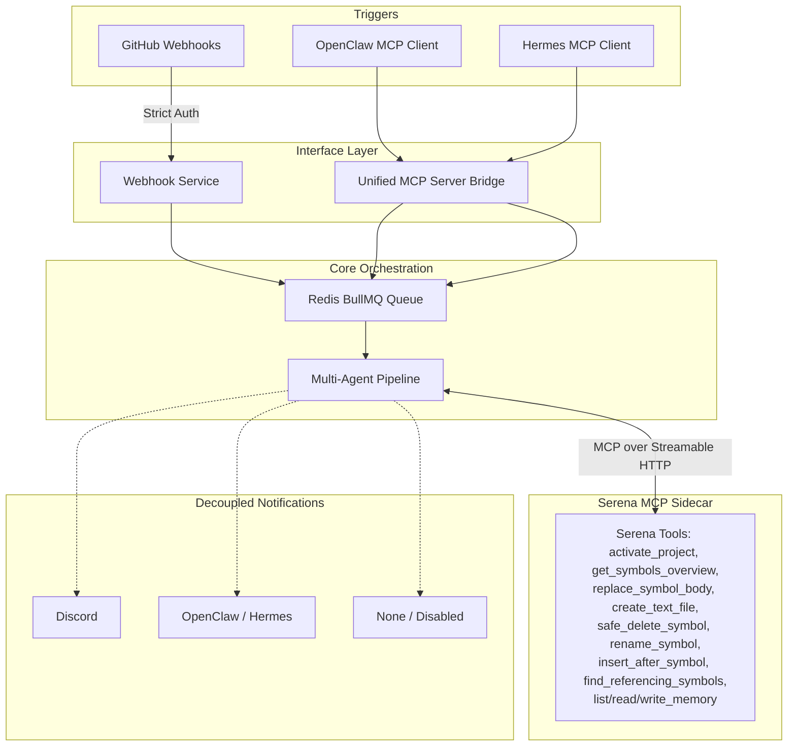

# Additional Features & Architecture Plan

> **Last Updated:** 2026-08-08

This document outlines the finalized architecture for implementing Serena memory onboarding, secure GitHub triggers, and a robust Model Context Protocol (MCP) server integration for autonomous platforms like OpenClaw and Hermes.

## Proposed Changes

### 1. Optional Serena Memory Onboarding

We will introduce a dedicated `OnboardingAgent` to handle Serena's memory initialization properly, making it configurable via environment variables.

#### `src/orchestration/agents/onboarding.agent.ts`
- **Purpose**: Runs after `IssueAnalyzerAgent` and before `ResearchAgent`.
- **Logic**: 
  - Checks if `process.env.ENABLE_SERENA_MEMORIES === 'true'`.
  - Calls `activate_project(worktreePath)`.
  - If the response contains onboarding instructions, it passes them to the LLM (Gemini/Ollama) and explicitly calls Serena's `write_memory` tool to generate the initial project context.
  - If the memory already exists, it skips gracefully.

#### Serena MCP Tools Used
The `OnboardingAgent` leverages these `SerenaMcpService` methods:
- `activateProject(worktreePath)` — Register the worktree with Serena's LSP.
- `writeMemory(name, content, projectPath)` — Persist the generated `global_repo_structure` memory.
- `readMemory(name, projectPath)` — Check if memory already exists before regenerating.
- `listMemories(projectPath)` — Enumerate existing memories for the project.

#### Configuration
- Add `ENABLE_SERENA_MEMORIES=false` to `.env` (defaulting to false to save tokens on ephemeral worktrees unless explicitly desired).

---

### 2. Secure GitHub Triggers (@lazydev & Issues)

We will update the GitHub Webhook service to listen for comments on PRs and issues, applying strict authorization checks before triggering a pipeline run.

#### Webhook Guardrails & Security Measures
- **Event Scope**: Listen for both `issue_comment.created` and standard `issues.opened`.
- **Authorization Check**:
  - We will check `payload.comment.author_association` (for comments) and `payload.issue.author_association` (for new issues).
  - The pipeline will **only** execute if `author_association` is `OWNER`, `MEMBER`, or `COLLABORATOR`. This cryptographically ensures that random users or external contributors cannot hijack your AI compute.
  - **Rate Limiting / Abuse Protection**: Add a basic check to prevent spam triggers from authorized users (e.g., max 5 concurrent runs per repo).

#### LLM Guardrails & Execution Security
Since the agent can now write net-new code and take complex instructions from chat platforms (Hermes/OpenClaw), we must protect the system against hallucinations and prompt injection:
- **Prompt Injection Defense**: All user-provided text (issue bodies, PR comments, OpenClaw chat messages) will be heavily sanitized and passed through a strict system-prompt boundary to prevent "ignore previous instructions" jailbreaks.
- **Output Validation**: Strict regex validation on the LLM's output (e.g., enforcing the `### SYMBOL:` syntax for patches). If the LLM hallucinates or returns malformed code, the pipeline aggressively throws an error and halts rather than executing broken code.
- **Isolated Execution (Sandboxing)**: The LLM's workspace is strictly confined to ephemeral Docker worktrees (`/app/worktrees`). It has zero access to the host machine or the core `lazy-issue-resolver` application memory.
- **Restricted File Scope**: The LLM is explicitly blocked from modifying sensitive files in the target repository (e.g., `.github/workflows`, `.serena/project.yml`, or `.env` files).

#### Serena MCP Tools Used in Patching
When patches are applied via `PatchGeneratorAgent`, the following Serena tools are dispatched based on the `action` field in the implementation plan:
| Action | Serena MCP Method | Fallback |
|---|---|---|
| `modify` | `replaceSymbolBody()` | — |
| `create` | `createTextFile()` | `fs.writeFile` |
| `delete` | `safeDeleteSymbol()` | `fs.unlink` (full file) |
| `rename` | `renameSymbol()` | — |

#### Execution Flow
- When an authorized `@lazydev` comment occurs on a PR, the `GitAgent` will checkout the *existing* PR branch, apply the new fixes dictated by the comment, and push to the same branch.

---

### 3. OpenClaw & Hermes MCP Server Integration

To allow platforms like OpenClaw and Hermes to command the agent, we will decouple the "GitHub Webhook" trigger from the core orchestration pipeline and expose `lazy-issue-resolver` as a unified **MCP Server**.

Both OpenClaw and Hermes natively support MCP, meaning they will automatically discover and understand the tools we expose without needing custom integration logic for each platform.

#### Expanded Capabilities (New Code & Features)
Through the MCP Server, OpenClaw and Hermes users won't just be limited to fixing GitHub issues. They can instruct the agent to write net-new code directly from chat.

**Tools Exposed to OpenClaw & Hermes**:
1. `trigger_issue_fix(repository, issue_number)`: Tell the agent to fix a specific GitHub issue.
2. `implement_new_feature(repository, feature_description)`: Tell the agent to write entirely new code or scaffold components based on a raw prompt, bypassing GitHub issues entirely.
3. `get_pipeline_status(task_id)`: Check if the AI is currently running, failed, or succeeded.
4. `provide_human_feedback(task_id, feedback)`: Inject human feedback into a stalled pipeline directly from the chat interface.

#### Decoupled Notifications Engine
Currently, `NotificationsService` hardcodes Discord. We will refactor this to be entirely decoupled and modular.
- Users who do not use Discord, OpenClaw, or Hermes will not be forced to provide webhook URLs. The system will gracefully degrade.
- **Supported Channels (Optional)**:
  - `DISCORD_WEBHOOK_URL`
  - `OPENCLAW_WEBHOOK_URL`
  - `HERMES_WEBHOOK_URL`
- When a pipeline finishes (or needs attention), the system broadcasts the structured event to whichever webhooks are configured.

## Architecture Diagram



---

### 4. Background Repository Ingestion & Webhook Integration Roadmap

* **Current Implementation Status**: ⚠️ **Deferred On-Demand Ingestion**
* **Details**: Full background indexing on app installation and incremental updates on git push are **not yet implemented** in the webhooks service. Instead, RAG ingestion is deferred and executed synchronously on-the-fly when the first issue job is processed by `IssueProcessor.process()` (which invokes `ragIngestion.ingestWorktree`).
* **Hermes Roadmap**: Implementing webhook listeners for `installation` and `push` events to trigger background ingestion will remove this ingestion latency from the critical path of issue processing.

---

### 5. How to Build the LazyDev MCP Server (for Hermes & OpenClaw)

> [!IMPORTANT]
> This section is the implementation guide for exposing `lazy-issue-resolver` as an MCP Server that Hermes and OpenClaw can connect to. Both platforms are MCP clients — they will automatically discover our tools via the MCP protocol handshake.

> [!NOTE]
> **Status: ✅ Implemented.** See `docs/sprint-plan/lazydev_mcp_server_plan.md` for the delivered design, and the corrections below. The illustrative code in §5.2 predates the shipped implementation; two details differ from the real `@modelcontextprotocol/sdk` (v1.29) API:
> 1. `StreamableHTTPServerTransport` takes `{ sessionIdGenerator }`, **not** `{ endpoint }`, and exposes `handleRequest(req, res, req.body)` — there is no `handlePostMessage` / `handleSse`.
> 2. In stateless mode a transport **cannot be reused across requests** (the SDK throws `Stateless transport cannot be reused across requests`). The implementation therefore builds a fresh `McpServer` + transport per request.
>
> The endpoint is also served through a NestJS controller (`src/mcp-server/mcp.controller.ts`) rather than by registering a route on the Express instance: routes added to the adapter after `app.init()` are shadowed by Nest's catch-all 404 handler.

#### 5.1 Concept: LazyDev as MCP Server vs. LazyDev as MCP Client

Currently, LazyDev is an **MCP Client** — it *connects to* the Serena MCP Server sidecar to use code intelligence tools. For Hermes/OpenClaw integration, LazyDev must *also* become an **MCP Server** — it *exposes* its own tools (issue fixing, feature implementation, status checks) to external platforms.

```
┌─────────────────────────────────────────────────────────────┐
│                     LazyDev Application                      │
│                                                              │
│  ┌──────────────────┐           ┌──────────────────────┐    │
│  │ MCP Client Side  │──────────▶│ Serena MCP Server    │    │
│  │ (serena-mcp.     │  Streamable│ (sidecar container) │    │
│  │  service.ts)     │  HTTP     │                      │    │
│  └──────────────────┘           └──────────────────────┘    │
│                                                              │
│  ┌──────────────────┐           ┌──────────────────────┐    │
│  │ MCP Server Side  │◀──────────│ Hermes / OpenClaw    │    │
│  │ (NEW: mcp-server │  Streamable│ (external MCP       │    │
│  │  .module.ts)     │  HTTP     │  clients)            │    │
│  └──────────────────┘           └──────────────────────┘    │
└─────────────────────────────────────────────────────────────┘
```

#### 5.2 Implementation Steps

##### Step 1: Install the MCP Server SDK

The `@modelcontextprotocol/sdk` package (already installed for the Serena client) also includes server-side classes.

```bash
# Already in package.json — no new install needed
npm ls @modelcontextprotocol/sdk
```

##### Step 2: Create the MCP Server Module

```
src/
├── mcp-server/
│   ├── mcp-server.module.ts       # NestJS module registration
│   ├── mcp-server.service.ts      # MCP Server lifecycle & tool registry
│   └── tools/
│       ├── trigger-issue-fix.tool.ts
│       ├── implement-feature.tool.ts
│       ├── get-pipeline-status.tool.ts
│       └── provide-feedback.tool.ts
```

##### Step 3: Implement `mcp-server.service.ts`

Use `McpServer` from the SDK to register tools and expose them over Streamable HTTP transport (same protocol Serena uses, so both Hermes and OpenClaw can connect identically).

```typescript
// src/mcp-server/mcp-server.service.ts
import { Injectable, OnModuleInit } from '@nestjs/common';
import { McpServer } from '@modelcontextprotocol/sdk/server/mcp.js';
import { StreamableHTTPServerTransport } from '@modelcontextprotocol/sdk/server/streamableHttp.js';
import { z } from 'zod';
import { OrchestrationService } from '../orchestration/orchestration.service';

@Injectable()
export class McpServerService implements OnModuleInit {
  private server: McpServer;

  constructor(
    private readonly orchestration: OrchestrationService,
  ) {}

  async onModuleInit() {
    this.server = new McpServer({
      name: 'lazydev-agent',
      version: '1.0.0',
    });

    // Register tools
    this.registerTools();

    // Start transport (expose on port 3334)
    const transport = new StreamableHTTPServerTransport({ endpoint: '/mcp' });
    await this.server.connect(transport);
  }

  private registerTools() {
    // Tool 1: trigger_issue_fix
    this.server.tool(
      'trigger_issue_fix',
      'Tell the agent to fix a specific GitHub issue.',
      {
        repository: z.string().describe('Full repo name, e.g. "owner/repo"'),
        issue_number: z.number().describe('The GitHub issue number'),
      },
      async ({ repository, issue_number }) => {
        // Construct issuePayload and queue into BullMQ
        // Return task_id for status polling
        return { content: [{ type: 'text', text: `Queued fix for ${repository}#${issue_number}` }] };
      }
    );

    // Tool 2: implement_new_feature
    this.server.tool(
      'implement_new_feature',
      'Write entirely new code based on a description, bypassing GitHub issues.',
      {
        repository: z.string().describe('Full repo name'),
        feature_description: z.string().describe('What to implement'),
      },
      async ({ repository, feature_description }) => {
        // Construct a synthetic issuePayload from the description
        // Queue into BullMQ pipeline
        return { content: [{ type: 'text', text: `Queued feature implementation for ${repository}` }] };
      }
    );

    // Tool 3: get_pipeline_status
    this.server.tool(
      'get_pipeline_status',
      'Check if the AI is currently running, failed, or succeeded.',
      {
        task_id: z.string().describe('The task ID returned by trigger_issue_fix or implement_new_feature'),
      },
      async ({ task_id }) => {
        // Query BullMQ job status
        return { content: [{ type: 'text', text: `Status for ${task_id}: running` }] };
      }
    );

    // Tool 4: provide_human_feedback
    this.server.tool(
      'provide_human_feedback',
      'Inject feedback into a stalled or validating pipeline from chat.',
      {
        task_id: z.string().describe('The task ID'),
        feedback: z.string().describe('Human feedback or correction'),
      },
      async ({ task_id, feedback }) => {
        // Update AgentState.validationFeedback for the running job
        return { content: [{ type: 'text', text: `Feedback injected for ${task_id}` }] };
      }
    );
  }
}
```

##### Step 4: Expose the MCP Endpoint via NestJS (Hybrid Toggle Approach)

We will implement a hybrid approach that allows you to seamlessly switch between two architectures using an environment variable.

*   **Default Behavior (Option A):** If `MCP_SERVER_PORT` is not set, it mounts the MCP transport to the existing NestJS Express server (e.g., port 3000). This is perfect for simple, self-hosted deployments.
*   **Isolated Behavior (Option B):** If `MCP_SERVER_PORT` (e.g., `3334`) is provided, it spins up a completely separate, standalone Express server. This is the industry-standard for public SaaS deployments, allowing you to use VPC firewalls to block external traffic to the MCP port while keeping the main web API public.

**Implementation (`mcp-server.service.ts`):**

```typescript
import { HttpAdapterHost } from '@nestjs/core';
import * as express from 'express';

// ... inside McpServerService
constructor(
  private readonly orchestration: OrchestrationService,
  private readonly adapterHost: HttpAdapterHost // Inject the adapter host
) {}

async onModuleInit() {
  // ... initialize server and register tools ...

  const mcpPort = process.env.MCP_SERVER_PORT;
  const transport = new StreamableHTTPServerTransport({ endpoint: '/mcp' });

  if (mcpPort) {
    // Option B: Standalone Server (Network Isolated)
    const app = express();
    app.use('/mcp', async (req, res) => await transport.handlePostMessage(req, res));
    app.get('/mcp', async (req, res) => await transport.handleSse(req, res));
    app.listen(parseInt(mcpPort, 10), () => {
      console.log(`Standalone MCP Server running securely on port ${mcpPort}`);
    });
  } else {
    // Option A: Mount on existing NestJS Server
    const app = this.adapterHost.httpAdapter.getInstance();
    app.use('/mcp', async (req, res) => await transport.handlePostMessage(req, res));
    app.get('/mcp', async (req, res) => await transport.handleSse(req, res));
    console.log(`MCP Server mounted on existing API port`);
  }

  await this.server.connect(transport);
}
```

##### Step 5: Configure Hermes & OpenClaw

Both platforms support MCP server discovery via a JSON configuration:

```json
{
  "mcpServers": {
    "lazydev": {
      "url": "http://your-server:3334/mcp",
      "transport": "streamable-http"
    }
  }
}
```

Once configured, Hermes/OpenClaw will automatically:
1. Connect to the `/mcp` endpoint
2. Call `list_tools` to discover `trigger_issue_fix`, `implement_new_feature`, `get_pipeline_status`, and `provide_human_feedback`
3. Expose those tools to the end user in their chat interface

##### Step 6: Wire into `docker-compose.yml`

To ensure users can easily toggle this, it's best to keep the environment variable commented out by default. 

```yaml
services:
  lazydev-api:
    # ... existing config ...
    ports:
      - "3000:3000"   # Main REST API + Webhooks
      
      # Uncomment the line below ONLY if you are using Option B (Standalone Server)
      # - "3334:3334"   
    
    environment:
      # Option A (Self-Hosted Default): Leave commented out. MCP runs on port 3000.
      # Option B (Public SaaS/Isolated): Uncomment and set to 3334.
      # - MCP_SERVER_PORT=3334
```

#### 5.3 Key Architectural Decisions

| Decision | Choice | Rationale |
|---|---|---|
| Transport Protocol | Streamable HTTP | Same as Serena client — proven, works over network, supported by both Hermes & OpenClaw |
| Job Queue | BullMQ (Redis) | MCP tool handlers should enqueue jobs, not run pipelines synchronously. Returns `task_id` immediately. |
| Auth | MCP-level (future) | Initially trust network-level security (private network). Add MCP auth headers for production. |
| Notifications | Bi-directional | Pipeline → Hermes/OpenClaw via webhook URLs. Hermes/OpenClaw → Pipeline via MCP `provide_human_feedback`. |

#### 5.4 Relationship to Serena MCP

The LazyDev MCP Server and the Serena MCP Client are **completely independent**:

- **Serena MCP Client** (`serena-mcp.service.ts`): LazyDev → Serena. Used internally by the pipeline agents for code intelligence (10 tools: `activate_project`, `get_symbols_overview`, `replace_symbol_body`, `create_text_file`, `safe_delete_symbol`, `rename_symbol`, `insert_after_symbol`, `find_referencing_symbols`, `list_memories`, `read_memory`, `write_memory`).
- **LazyDev MCP Server** (`mcp-server.service.ts`): Hermes/OpenClaw → LazyDev. Exposes high-level orchestration commands (4 tools: `trigger_issue_fix`, `implement_new_feature`, `get_pipeline_status`, `provide_human_feedback`).

```
Hermes/OpenClaw ──MCP──▶ LazyDev MCP Server ──BullMQ──▶ Pipeline ──MCP──▶ Serena
```

